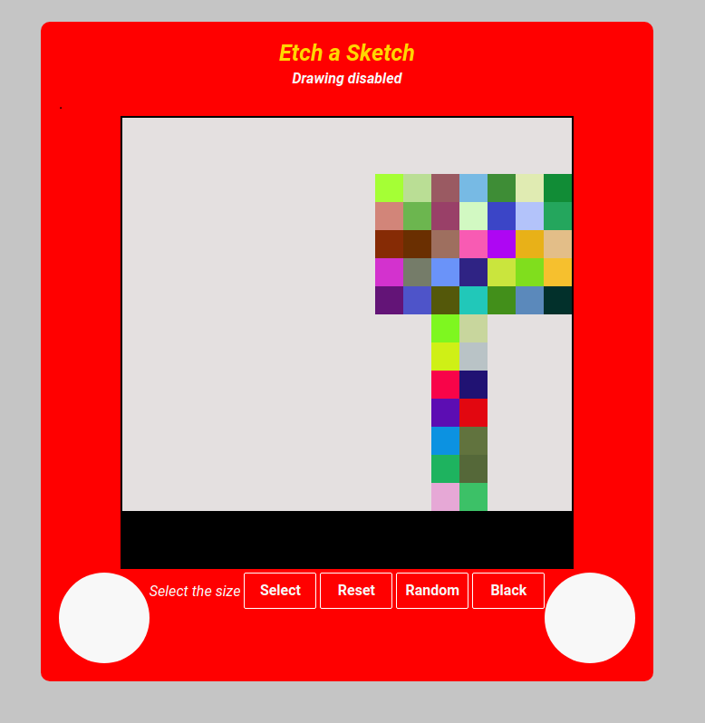

# Etch-a-Sketch
- Live demo -> https://masecurity.github.io/Etch-a-Sketch/  

## What is Etch-a-Sketch
The Etch-a-Sketch project is an interactive drawing application built using HTML, CSS, and JavaScript. It allows users to draw and create their sketches on a grid-based canvas. Users can toggle drawing mode on and off by clicking anywhere on the canvas. When drawing mode is enabled, users can hover over the board to draw using either the default black color or a random color.
The application also features a "Select" button that allows users to choose the size of the drawing board. The board can be set to various sizes, from 16 by 16 up to a maximum of 100 by 100 squares, providing flexibility and customization for users' artistic endeavors.
Additionally, there is a "Reset" button that clears the drawing, allowing users to start with a fresh canvas and create new artwork.

## What i learned
During the development of the Etch-a-Sketch project, I gained valuable knowledge and skills in the following areas:
- DOM manipulation: 
  I learned how to interact with the Document Object Model (DOM) to dynamically update the user interface and create interactive features.
- Events: 
  implementing mouseover and click events allowed me to respond to user actions effectively, enabling drawing functionality based on user interactions.
- CSS Grid:
  CSS Grid was utilized to create the grid-based layout, which efficiently arranged the square divs to form the drawing board.
- User Input Handling:
  The project involved taking user input through prompt dialogs and validating the user's chosen board size to ensure it falls within a suitable range (0 to 100).
- Functions:
  Utilizing functions helped in organizing the code and making it modular, improving readability and maintainability.
- HTML, CSS and JavaScript:
  Working on this project allowed me to enhance my proficiency in these web technologies, enabling me to create engaging and responsive applications.

Overall, the Etch-a-Sketch project provided me with practical experience in web development and improved my proficiency in HTML, CSS, and JavaScript. I learned how to create an interactive application that fosters creativity and artistic expression while utilizing key web development concepts effectively. The addition of the reset button further enhances the usability of the application, providing users with a convenient way to clear the canvas and start afresh.

